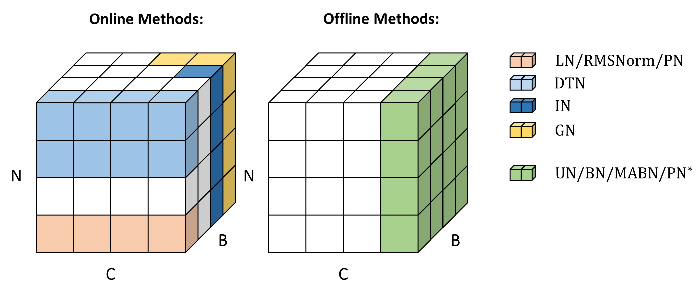

# Unified-Normalization (ACM MM'22)
By Qiming Yang, Kai Zhang, Chaoxiang Lan, Zhi Yang, Zheyang Li, Wenming Tan, Jun Xiao, and Shiliang Pu. 

This repository is the official implementation of ["Unified Normalization for Accelerating and Stabilizing Transformers"](https://arxiv.org/abs/2208.01313).



Download this repo by 
```shell
git clone https://github.com/hikvision-research/Unified-Normalization
```

## Usage on Neural Machine Translation

### Requirements and Installation
We develop our method on [IWSLT14De2En](https://wit3.fbk.eu/archive/2014-01/texts/de/en/de-en.tgz) with the framework of [fairseq](https://github.com/facebookresearch/fairseq).

fairseq == 1.0.0

Python >= 3.6.5

Pytorch >= 1.6.0

Follow the next steps to install fairseq locally:
```shell
cd Unified-Normalization/neural_machine_translation
pip install -r requirements.txt
pip setup.py install
```

### Data Preparation

Please follow the script for preprocessing as [prepare_iwslt14_de2en.sh](./neural_machine_translation/data_preprocessing/machine_translation/prepare_iwslt14_de2en.sh)

```shell
bash data_preprocessing/machine_translation/prepare_iwslt14_de2en.sh
```

Once all commands are finished sccessfully, the processed data should be found at ```./neural_machine_translation/data/iwslt14de2en/data-bin/iwslt14.tokenized.de-en/```

### Evaluation

To averaging last 10 checkpoints:
```shell
save_dir=path/to/saved/ckpt
num=10
python scripts/average_checkpoints.py \
--inputs $save_dir \
--num-epoch-checkpoints $num \
--output $save_dir/checkpoint_avg_$num.pt
```
Then, evaluate the model on single GPU as:
```shell
python -W ignore fairseq_cli/generate.py \
data/iwslt14de2en/data-bin/iwslt14.tokenized.de-en/ \
--path $save_dir/checkpoint_avg_$num.pt \
--batch-size 256 \
--beam 5 \
--remove-bpe \
--quiet
```

You could find the evaluation script at [run_iwslt14_eval.sh](./neural_machine_translation/run_iwslt14_eval.sh).

### Training

We trained our models on single GPU (V100). Please refer to [run_iwslt14_train_un.sh](./neural_machine_translation/run_iwslt14_train_un.sh) for training Transformer with UN1d and [run_iwslt14_train.sh](./neural_machine_translation/run_iwslt14_train.sh) for LayerNorm (baseline).

### Results

| Method | Offline | IWSLT14 (BELU) |
|--------|---------|----------------|
|LN      |$\times$ |35.3 |
|BN       |$\surd$ |31.1 |
|UN (ours)|$\surd$ |35.4 ([checkpoint](https://drive.google.com/open?id=1-ZEW2vR_ptXn1g8nlmlYRfqFJi9OnkNd&authuser=cheermyang%40gmail.com&usp=drive_fs), [log](https://drive.google.com/open?id=16Xuea_NyTsBypp1rITBg_tH-RoehA6lf&authuser=cheermyang%40gmail.com&usp=drive_fs)) |


## Usage on Image Classification

### Requirements and Installation

timm==0.3.4

torch>=1.4.0

torchvision>=0.5.0

pyyaml

### Data Preparation
We conduct image classification on [ImageNet](http://image-net.org/)/[CIFAR10](https://www.cs.toronto.edu/~kriz/cifar.html)/[CIFAR100](https://www.cs.toronto.edu/~kriz/cifar.html). Please download these datasets from the corresponding hyperlinks.

For ImageNet, all samples are structured as below:

```
│imagenet/
├──train/
│  ├── n01440764
│  │   ├── n01440764_10026.JPEG
│  │   ├── n01440764_10027.JPEG
│  │   ├── ......
│  ├── ......
├──val/
│  ├── n01440764
│  │   ├── ILSVRC2012_val_00000293.JPEG
│  │   ├── ILSVRC2012_val_00002138.JPEG
│  │   ├── ......
│  ├── ......
```

### Evaluation

On ImageNet:
```
cd ./image_classification

ckpt_file=path/to/ckpt
data_dir=path/to/imagenet
CUDA_VISIBLE_DEVICES=0 python main.py \
    $data_dir \
    --model T2t_vit_14_all_un1d \
    --img-size 224 \
    -b 64 \
    --eval_checkpoint $ckpt_file
```

On CIFAR10:
```
cd ./image_classification

ckpt_file=path/to/ckpt
data_dir=path/to/cifar10

CUDA_VISIBLE_DEVICES=0 python transfer_learning.py \
    --dataset 'cifar10' \
    --data-dir $data_dir \
    --b 128 \
    --num-classes 10 \
    --img-size 224 \
    --model T2t_vit_14_all_un1d \
    --eval \
    --transfer-model $ckpt_file \
```

On CIFAR100:
```
cd ./image_classification

ckpt_file=path/to/ckpt
data_dir=path/to/cifar10

CUDA_VISIBLE_DEVICES=0 python transfer_learning.py \
    --dataset 'cifar100' \
    --data-dir $data_dir \
    --b 128 \
    --num-classes 100 \
    --img-size 224 \
    --model T2t_vit_14_all_un1d \
    --eval \
    --transfer-model $ckpt_file \
```


### Training (ImageNet)

```
cd ./image_classification

# training on 8 gpus (V100)
save_dir=path/to/saved/ckpt
data_dir=path/to/imagenet

CUDA_VISIBLE_DEVICES=0,1,2,3,4,5,6,7 bash distributed_train.sh 8 \
    $data_dir \
    --model T2t_vit_14_all_un1d \
    --batch-size 64 \
    --lr 5e-4 \
    --weight-decay 0.05 \
    --img-size 224 \
    --output $save_dir
```

### Transfer (CIFAR10/100)

Please follow [run_finetune.sh](./image_classification/run_finetune.sh) to finetune models on CIFAR10/100 with single GPU.

Tips: DO NOT forget to reset the parameter 'iters' (that counts iteration) in UN with zero after loading pretrained weights, then UN can enjoy the warming-up phase during down-stream training/finetuning.

### Results

| Method | Offline | ImageNet (Top1)| CIFAR10 (Top1) | CIFAR100 (Top1) |
|--------|---------|----------------|----------------|-----------------|
|LN      | $\times$ |81.5%           |98.3%           |88.4%            |
|BN       | $\surd$ |79.8%           |96.6%           |88.2%            |
|UN (ours)| $\surd$ |80.9% ([checkpoint](https://drive.google.com/open?id=1-a3tdPxOJ9QK4GlcbXndCpNvqcaLxR6v&authuser=cheermyang%40gmail.com&usp=drive_fs), [log](https://drive.google.com/open?id=1lAO_q6L5aSDz8izE9kWApsX0PXlhcnxC&authuser=cheermyang%40gmail.com&usp=drive_fs)) |98.3% ([checkpoint](https://drive.google.com/open?id=1u5yYIah4KG4a0Yeg4CsNNfxpmh72Dp7x&authuser=cheermyang%40gmail.com&usp=drive_fs)) |88.9% ([checkpoint](https://drive.google.com/file/d/11ijHHyvgeOkBb28rizKAmkXXxXTdFVC9/view?usp=sharing)) |


## Citation

If you find this repo is useful, please consider citing our paper:
```BibTeX
@inproceedings{yang2022unified,
  title={Unified Normalization for Accelerating and Stabilizing Transformers},
  author={Yang, Qiming and Zhang, Kai and Lan, Chaoxiang and Yang, Zhi and Li, Zheyang and Tan, Wenming and Xiao, Jun and Pu, Shiliang},
  booktitle={Proceedings of the 30th ACM International Conference on Multimedia},
  pages={4445--4455},
  year={2022}
}
```

## License

Unified Normalization is released under the [Apache 2.0 license](./LICENSE). Other codes from open-source repositories follow the original distributive licenses.

## Acknowledgement

We would like to thank the teams of [fairseq](https://github.com/facebookresearch/fairseq) and [T2T-ViT](https://github.com/yitu-opensource/T2T-ViT) for developing these easy-to-use works.
